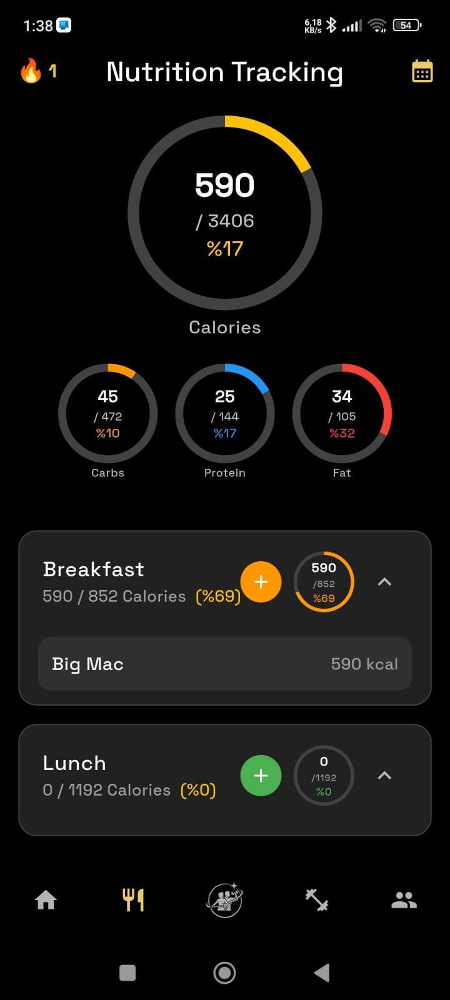

# 🚀 Upnox Showcase

Upnox, spor salonu üyeleri ve bireysel sporcular için geliştirilen, antrenman ve beslenme süreçlerini dijitalleştirerek daha sistematik, ölçülebilir ve sürdürülebilir hale getirmeyi amaçlayan bir mobil uygulamadır.

Bu repository, Upnox projesinin mimarisini, mühendislik yaklaşımını ve teknik kararlarını sergilemek amacıyla oluşturulmuştur.

---

## 🎯 Projenin Amacı

Fitness sürecinde kullanıcıların en büyük problemi:

* Takip eksikliği
* Disiplinsiz veri girişi
* Beslenme ve antrenman verilerinin dağınık olması
* Motivasyon kaybı

Upnox şu problemleri çözmeyi hedefler:

* 📊 Kullanıcının antrenman ve beslenme verilerini tek yerde toplamak
* 🔐 Güvenli backend mimarisi ile kullanıcı verilerini korumak
* 🏷 Her kullanıcıya özel beslenme önerisi ve antrenman önerisi
* ⚡ Gerçek zamanlı ve senkronize veri yapısı ile tutarlı kullanıcı deneyimi sunmak

Amaç:
Sporu “rastgele yapılan bir aktivite” olmaktan çıkarıp ölçülebilir bir sisteme dönüştürmek.

---

## 📱 Uygulama Ekranları

### Ana Dashboard
Dashboard 

### Besin Arama ve Kalori Takibi
Nutrition 

### İstatistikler
Stats 

---

## 🏗 Mimari ve Teknoloji Yığını

### 📱 Frontend

* Flutter

### ☁ Backend

* Firebase Authentication
* Firebase Firestore
* Firebase Cloud Functions
* Google Cloud altyapısı

### 🔐 Güvenlik Yaklaşımı

* API key ve secret bilgileri **client tarafında tutulmaz**
* FatSecret REST API OAuth 1.0 entegrasyonu Cloud Functions üzerinden yapılır
* Tüm hassas işlemler server-side yürütülür
* Role-based veri erişimi

### 🗄 Veritabanı Modeli (Özet)

Örnek koleksiyon yapısı:

    users/

    └── userId

        ├── profile
        ├── subscription
        ├── nutrition_logs
        └── workout_logs
        ...

    exercises/
           └── exercise_name
           ├── id
           ├── category
           ├── force
           ├── images
           └── instructions
           ...

## ⚔️ Karşılaşılan Zorluklar ve Çözümler

### 1️⃣ Üçüncü Parti API Güvenliği (FatSecret)

Problem:
API key’lerin client tarafında tutulması uygulamayı reverse engineering saldırılarına açık hale getiriyordu.

Çözüm:
OAuth 1.0 imzalama işlemi tamamen Cloud Functions içine taşındı.
Client → Cloud Function → FatSecret akışı kuruldu.

Böylece:

* Secret key hiçbir zaman mobil uygulamaya gömülmedi.
* API abuse riski minimize edildi.

---

### 2️⃣ Veri Senkronizasyonu

Problem:
Beslenme ve antrenman loglarında offline/online senkronizasyon tutarsızlıkları oluşuyordu.

Çözüm:

* Firestore’un real-time listener yapısı kullanıldı.
* State management Riverpod ile yeniden tasarlandı.
* Immutable veri modeli tercih edildi.

Bu sayede UI tarafında “stale state” problemleri ortadan kaldırıldı.

---

## 📈 Proje Vizyonu

Upnox sadece bir fitness takip uygulaması değil,
Sporcularını kişisel koçtan daha iyi takip eden onlara özel programlar yazabilen etkileşimli bir uygulama.

---

## 👤 Developer

Atahan Işıklı

Computer Engineering Student
