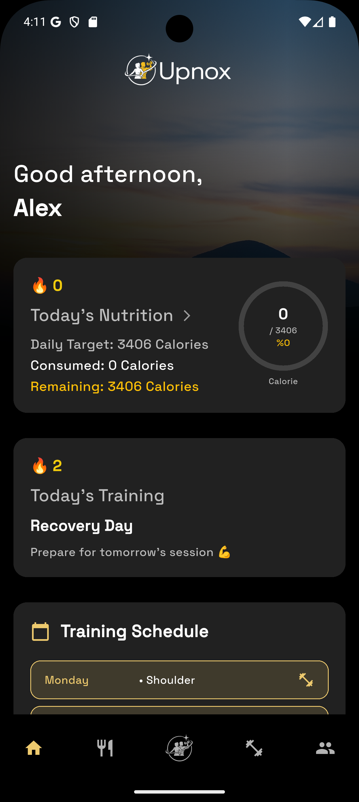
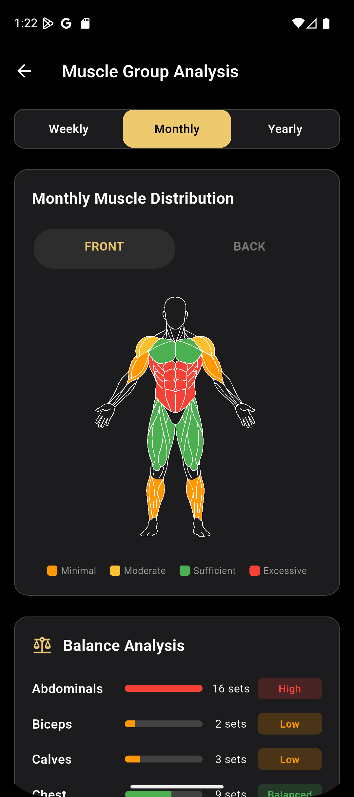

# 🚀 Upnox Showcase

🇹🇷 Türkçe versiyon için: [README-tr.md](./README-tr.md)

---

## 🎯 Project Purpose

Upnox is a mobile application designed for gym members and individual athletes to digitize and systematize their training and nutrition processes.

Many athletes struggle with:

* Lack of consistent tracking
* Scattered nutrition and workout data
* Unstructured progress monitoring
* Motivation loss due to invisible progress

Upnox aims to solve these problems by:

* 📊 Centralizing workout and nutrition data
* 🔐 Protecting user data with a secure backend architecture
* 🏷 Providing personalized nutrition and workout recommendations
* ⚡ Delivering real-time synchronized data for a consistent user experience

The goal is to transform fitness from a random activity into a measurable, data-driven system.

---

## 📱 Application Screenshots

### Main Dashboard

![Dashboard]

### Nutrition Search & Calorie Tracking

### Statistics & Progress Tracking

---

## 🏗 Architecture & Technology Stack

### 📱 Frontend

* Flutter

### ☁ Backend

* Firebase Authentication
* Firebase Firestore
* Firebase Cloud Functions
* Google Cloud Infrastructure

---

## 🔐 Security Approach

* API keys and secrets are **never stored on the client side**
* FatSecret REST API (OAuth 1.0) integration is handled entirely via Cloud Functions
* All sensitive operations are executed server-side
* Role-based data access model

Architecture flow:

Client → Cloud Function → Third-Party API
Client never directly communicates with external secured services.

---

## 🗄 Database Model (Overview)

Example Firestore structure:

users/
   └── userId
        ├── profile
        ├── subscription
        ├── nutrition_logs
        └── workout_logs
        ...

exercises/
   └── exercise_name
        ├── id
        ├── category
        ├── force
        ├── images
        └── instructions
        ...

Design principles:

* Structured user-based data isolation
* Scalable document-based modeling
* Optimized read/write patterns for performance

---

## ⚔️ Engineering Challenges & Solutions

### 1️⃣ Third-Party API Security (FatSecret)

**Problem:**
Storing API keys on the client side exposes the application to reverse engineering and abuse risks.

**Solution:**
OAuth 1.0 signing process was fully migrated to Firebase Cloud Functions.
The authentication flow was redesigned as:

Client → Cloud Function → FatSecret API

Result:

* Secret keys are never exposed in the mobile application
* API abuse risk minimized
* Server-side request validation enforced

---

### 2️⃣ Data Synchronization Issues

**Problem:**
Offline/online state inconsistencies caused stale UI data during workout and nutrition log updates.

**Solution:**

* Firestore real-time listeners implemented
* State management redesigned for predictable state flow
* Immutable data modeling adopted

Outcome:

* Eliminated stale state issues
* Improved UI consistency
* Reduced unexpected re-renders

---

## 📈 Vision

Upnox is not just a fitness tracking application.

It aims to become an intelligent, interactive ecosystem that can track athletes more consistently than a traditional personal coach and generate personalized workout and nutrition programs based on user data.

---

## 👤 Developer

Atahan Işıklı
Computer Engineering Student
Backend & Systems-Focused Mobile Developer

Nasıl ilerleyelim?
